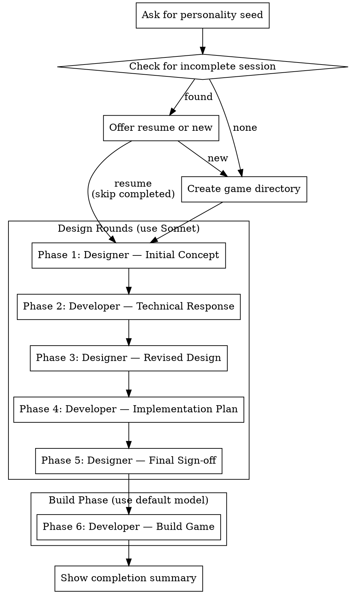

# AI Game Jam

## Overview

Orchestrate two AI agents — a game designer and a game developer — to autonomously collaborate and produce a complete, playable game. The user provides a personality seed for the designer, then the system runs 6 phases without human interaction.

## Arguments

- **No arguments** (`/game-jam`): Start a new game jam (prompts for personality and constraints)
- **`resume`** (`/game-jam resume`): Resume an incomplete game jam (lists all in-progress jams in current directory)

## The Process



## Step-by-Step Execution

### 1. Setup

**Resume Mode** (`/game-jam resume`):

1. Search the working directory for all `*-game*/state.json` files with `"status": "in_progress"`
2. If none found, tell the user "No incomplete game jams found. Run `/game-jam` to start a new one."
3. If one found, announce which jam will resume (show personality, theme, gameType, models, and current phase), then load its state
4. If multiple found, present them to the user using AskUserQuestion:
   - Show each jam's directory name, creation date, current phase, personality/theme/gameType, and models being used
   - Let user select which to resume
5. Load the selected `state.json` and skip to "Run Phases" (step 2)

**New Game Mode** (`/game-jam` with no arguments):

Ask the user for game jam parameters using AskUserQuestion:

**First prompt** (game jam configuration):

1. **Designer personality seed** (required):
   - Can be a short phrase ("chaotic goblin energy") or a full character description
   - This shapes the designer agent's creative instincts

2. **Game jam theme** (optional):
   - A creative constraint or subject matter for the game
   - Examples: "bananas", "killer clown", "space", "happiness", "time travel"
   - If provided, the game must incorporate this theme
   - Leave blank to skip

3. **Game type** (optional):
   - A genre or style constraint for the game
   - Examples: "roguelike", "2-bit color style", "text-based", "puzzle platformer", "bullet hell"
   - If provided, the game must fit this type
   - Leave blank to skip

**Second prompt** (model selection):

4. **Designer agent model** (optional):
   - Which model to use for designer phases (1, 3, 5)
   - Options: "Opus 4.6 (Recommended)" or "Sonnet 4.5"
   - Default: Opus 4.6 (more capable, better game quality)

5. **Developer agent model** (optional):
   - Which model to use for developer phases (2, 4, 6)
   - Options: "Opus 4.6 (Recommended)" or "Sonnet 4.5"
   - Default: Opus 4.6 (more capable, better game quality)

Create the game directory structure:

```
YYYY-MM-DD-game/        (increment suffix if exists: -game-2, -game-3)
├── state.json
├── plans/
└── logs/
```

Initialize `state.json`:
```json
{
  "created": "2026-02-06T21:45:00Z",
  "personality": "<seed>",
  "theme": "<theme or null>",
  "gameType": "<game type or null>",
  "designerModel": "opus",
  "developerModel": "opus",
  "currentPhase": "designer-round1",
  "completedPhases": [],
  "gameDir": null,
  "status": "in_progress"
}
```

Model values: `"sonnet"` for Sonnet 4.5, `"opus"` for Opus 4.6

### 2. Run Phases

Each phase dispatches a Task subagent. Use the model specified in state.json:
- Designer phases (1, 3, 5): use `state.designerModel`
- Developer phases (2, 4, 6): use `state.developerModel`

**Before each phase:**
- Check if phase is already in `completedPhases` — skip if so
- Update `currentPhase` in state.json
- Tell the user which phase is running

**After each phase:**
- Add phase to `completedPhases` in state.json
- Tell the user the phase is complete

**Phase-to-file mapping and agent prompts:** See @prompts.md for complete agent prompts for each phase.

| Phase | Agent | Output File | Tools Needed |
|-------|-------|-------------|--------------|
| 1. designer-round1 | Designer | `plans/01-concept.md` | Write, Read |
| 2. developer-round1 | Developer | `plans/02-tech-response.md` | Write, Read |
| 3. designer-round2 | Designer | `plans/03-revised-design.md` | Write, Read |
| 4. developer-round2 | Developer | `plans/04-impl-plan.md` | Write, Read |
| 5. designer-round3 | Designer | `plans/05-final-spec.md` | Write, Read |
| 6. developer-build | Developer | Game source directory | All tools |

**Dispatching each phase subagent:**

Before dispatching, replace placeholders in the system prompt from prompts.md:
- `{{PERSONALITY}}` → user's personality seed from state.json
- `{{THEME_CONSTRAINT}}` → if theme exists: `"GAME JAM THEME: Your game must incorporate this theme: \"[theme]\"\n\nThis is a required constraint. Find creative ways to make this theme central to your game."` | if null: remove this line entirely
- `{{GAME_TYPE_CONSTRAINT}}` → if gameType exists: `"GAME JAM TYPE: Your game must be this type: \"[gameType]\"\n\nThis is a required constraint. Design your game to fit this genre/style."` | if null: remove this line entirely

```
Task tool (general-purpose):
  model: <from state.json - designerModel for phases 1,3,5 or developerModel for phases 2,4,6>
  description: "Phase N: [phase name]"
  prompt: |
    [System prompt from prompts.md with placeholders replaced]

    [Phase prompt from prompts.md]

    IMPORTANT: Your working directory is [absolute path to game dir].
    Write all files relative to this directory.

    TOOL RESTRICTIONS: You should ONLY use [Read, Write] tools.
    Do not use Bash, Edit, or any other tools.
    (For phase 6: You have full tool access.)
```

**Note on tool restrictions:** Task subagents cannot have tools restricted programmatically. Include explicit instructions in the prompt about which tools the agent should use. Design phase agents should be told to only use Read and Write. The build phase agent gets full access.

### 3. Completion

After all 6 phases complete:
- Update `state.json` status to `"complete"`
- Find the game source directory (any subdirectory that isn't `plans/` or `logs/`)
- Read the game's `README.md` if it exists
- Present a summary to the user:
  - Game name and location
  - How to run it
  - Whether any installs are needed (check for `SETUP.md`)
  - Pointer to `plans/` and `logs/` for reviewing the creative process

## Key Details

- **Personality seed** shapes designer creativity but isn't a literal directive — the designer is told to "surprise yourself"
- **Theme constraint** (optional): If provided, the game must incorporate this theme creatively
- **Game type constraint** (optional): If provided, the game must fit this genre/style
- **Model selection**: Users choose between Opus 4.6 (recommended, more capable) or Sonnet 4.5 for each agent role. Defaults to Opus 4.6 for both
- **Scope enforcement**: Designer prompt limits to game-jam-small; Developer rejects anything beyond "medium" complexity
- **macOS-compatible** tech only — browser games, Python/Pygame, Node, etc.
- **Assets directory**: Developer is instructed to put all art/images/sounds in `assets/` inside the game source directory
- **Collaboration log**: Both agents append reasoning to `logs/collaboration.md` each round
- **Pausable**: User can stop at any time (Ctrl+C or close Claude). Progress is automatically saved in `state.json` after each phase completes
- **Resumable**: Use `/game-jam resume` to resume any incomplete game jam. The skill tracks `currentPhase` and `completedPhases` in state.json and skips already-completed work

## Common Mistakes

- Forgetting to update `state.json` between phases — always update before and after
- Using the wrong model for a phase — always read `designerModel` or `developerModel` from state.json
- Not providing the absolute working directory path in each subagent prompt
- Skipping the collaboration log instruction — agents need to be told to append to `logs/collaboration.md`
