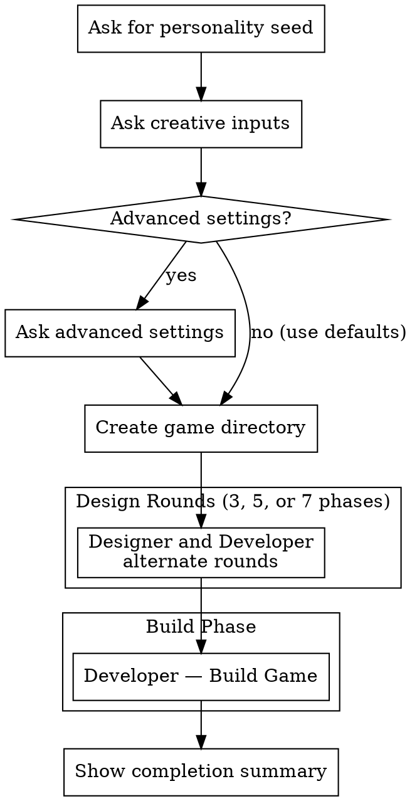

# AI Game Jam

## Overview

Orchestrate two AI agents — a game designer and a game developer — to autonomously collaborate and produce a complete, playable game. The user provides a personality seed for the designer plus optional constraints, then the system runs the design and build phases without human interaction.

## Arguments

- **No arguments** (`/game-jam`): Start a new game jam (prompts for personality and constraints)
- **`resume`** (`/game-jam resume`): Resume an incomplete game jam (lists all in-progress jams in current directory)

## The Process



## Step-by-Step Execution

### 1. Setup

**Resume Mode** (`/game-jam resume`):

1. Search the working directory for all `*-game*/state.json` files with `"status": "in_progress"`
2. If none found, tell the user "No incomplete game jams found. Run `/game-jam` to start a new one."
3. If one found, announce which jam will resume (show personality, theme, gameType, complexity, scope, rounds, and current phase), then load its state
4. If multiple found, present them to the user using AskUserQuestion:
   - Show each jam's directory name, creation date, current phase, personality/theme/gameType/complexity/scope/rounds
   - Let user select which to resume
5. Load the selected `state.json` and skip to "Run Phases" (step 2)
6. Backfill missing legacy fields before resuming:
   - If `designComplexity` is missing, set it to `standard`
   - If `gameScope` is missing, set it to `"small"`
   - If `designRounds` is missing, set it to `5`

**New Game Mode** (`/game-jam` with no arguments):

Ask the user for game jam parameters using AskUserQuestion.
Prompting rules for new games:
- Ask setup questions in order, one question at a time.
- Wait for the user's answer before asking the next question.
- Do not skip optional questions; explicitly ask them.
- For optional questions, always include a "None" / "No preference" style option as the first selectable choice so users don't feel forced to pick a value.
- Do not infer or auto-fill answers from prior context except documented defaults when the user leaves a question blank.
- Do not start phase execution until all setup questions have been asked and resolved.

**Creative inputs** (always ask):

1. **Designer personality seed** (required):
   - Can be a short phrase ("chaotic goblin energy") or a full character description
   - This shapes the designer agent's creative instincts

2. **Game jam theme** (optional):
   - A creative constraint or subject matter for the game
   - Examples: "bananas", "killer clown", "space", "happiness", "time travel"
   - If provided, the game must incorporate this theme
   - Must include a "No theme (surprise me)" option as the first choice

3. **Game type** (optional):
   - A genre or style constraint for the game
   - Examples: "roguelike", "2-bit color style", "text-based", "puzzle platformer", "bullet hell"
   - If provided, the game must fit this type
   - Must include a "No preference" option as the first choice

**Advanced settings** (gated):

4. **Adjust advanced settings?** (yes/no, default: no):
   - If the user says no (or leaves blank), use all defaults and proceed to directory creation
   - If the user says yes, ask the following one at a time:

5. **Design complexity** (optional, default: `standard`):
   - How deeply the *designer agent* explores ideas before converging. Does not affect the developer or build phase.
   - Options:
     - `light` — Designer picks a direction quickly, keeps handoff notes brief. Good for fast jams.
     - `standard (recommended)` — Designer considers alternatives before committing, provides clear handoff. Balanced.
     - `deep` — Designer explores multiple directions with detailed rationale and edge-case notes. Best for ambitious concepts.

6. **Game scope** (optional, default: `small`):
   - How big and ambitious the game is.
   - Options:
     - `tiny` — Single mechanic, minimal visuals, 2-3 minutes of play. One-button games, micro-arcade. Build stays under 5 steps.
     - `small (recommended)` — One core mechanic, simple visuals, ~5 minutes of fun. Classic game jam size. Build stays under 15 steps.
     - `medium` — 1-2 interlocking mechanics, more content and polish, 10-15 minutes of play. Up to 25 build steps. Allows HARD build complexity.

7. **Design rounds** (optional, default: `5`):
   - How many back-and-forth rounds between designer and developer before building.
   - Options:
     - `3` — Concept → tech response + plan → sign-off. Minimal discussion, fast to game.
     - `5 (recommended)` — Full cycle: concept → feedback → revision → implementation plan → sign-off.
     - `7` — Extra revision loop for more thorough design iteration. Best paired with `deep` complexity or `medium` scope.

Create the game directory structure:

```
YYYY-MM-DD-game/        (increment suffix if exists: -game-2, -game-3)
├── state.json
├── plans/
└── logs/
```

Initialize `state.json`:
```json
{
  "created": "2026-02-06T21:45:00Z",
  "personality": "<seed>",
  "theme": "<theme or null>",
  "gameType": "<game type or null>",
  "designComplexity": "standard",
  "gameScope": "small",
  "designRounds": 5,
  "currentPhase": "designer-round1",
  "completedPhases": [],
  "phaseTimings": {},
  "status": "in_progress"
}
```

### 2. Run Phases

Each phase dispatches a Task subagent. All subagents inherit the current session's model automatically — do not pass a `model` parameter to the Task tool.

**Before each phase:**
- Check if phase is already in `completedPhases` — skip if so
- Update `currentPhase` in state.json
- Record the phase start time: run `date +%s` via Bash and store the unix timestamp in `state.json` under `phaseTimings.<phase-name>.start`
- Tell the user which phase is running

**After each phase:**
- Record the phase end time: run `date +%s` via Bash and store the unix timestamp in `state.json` under `phaseTimings.<phase-name>.end`
- Add phase to `completedPhases` in state.json
- Tell the user the phase is complete

**Phase-to-file mapping depends on `designRounds`.** See @prompts.md for complete agent prompts for each phase.

**3 rounds:**

| Phase | Agent | Output File | Tools |
|-------|-------|-------------|-------|
| 1. designer-round1 | Designer | `plans/01-concept.md` | Read, Write |
| 2. developer-round1 | Developer | `plans/02-tech-response-and-plan.md` | Read, Write |
| 3. designer-round2 | Designer | `plans/03-final-spec.md` | Read, Write |
| 4. developer-build | Developer | Game source directory | All tools |

**5 rounds (default):**

| Phase | Agent | Output File | Tools |
|-------|-------|-------------|-------|
| 1. designer-round1 | Designer | `plans/01-concept.md` | Read, Write |
| 2. developer-round1 | Developer | `plans/02-tech-response.md` | Read, Write |
| 3. designer-round2 | Designer | `plans/03-revised-design.md` | Read, Write |
| 4. developer-round2 | Developer | `plans/04-impl-plan.md` | Read, Write |
| 5. designer-round3 | Designer | `plans/05-final-spec.md` | Read, Write |
| 6. developer-build | Developer | Game source directory | All tools |

**7 rounds:**

| Phase | Agent | Output File | Tools |
|-------|-------|-------------|-------|
| 1. designer-round1 | Designer | `plans/01-concept.md` | Read, Write |
| 2. developer-round1 | Developer | `plans/02-tech-response.md` | Read, Write |
| 3. designer-round2 | Designer | `plans/03-revised-design.md` | Read, Write |
| 4. developer-round2 | Developer | `plans/04-dev-feedback.md` | Read, Write |
| 5. designer-round3 | Designer | `plans/05-second-revision.md` | Read, Write |
| 6. developer-round3 | Developer | `plans/06-impl-plan.md` | Read, Write |
| 7. designer-round4 | Designer | `plans/07-final-spec.md` | Read, Write |
| 8. developer-build | Developer | Game source directory | All tools |

**Dispatching each phase subagent:**

Before dispatching, replace placeholders in prompts.md:
- `{{PERSONALITY}}` → user's personality seed from state.json
- `{{THEME_CONSTRAINT}}` → if theme exists: `"GAME JAM THEME: Your game must incorporate this theme: \"[theme]\"\n\nThis is a required constraint. Find creative ways to make this theme central to your game."` | if null: remove this line entirely
- `{{GAME_TYPE_CONSTRAINT}}` → if gameType exists: `"GAME JAM TYPE: Your game must be this type: \"[gameType]\"\n\nThis is a required constraint. Design your game to fit this genre/style."` | if null: remove this line entirely
- `{{DESIGNER_COMPLEXITY_GUIDANCE}}` → for designer phases only, replace with:
  - if `designComplexity = light`:
    `"DESIGN COMPLEXITY: LIGHT.\nThink briefly and converge fast. Share only implementation-critical details with the developer.\nKeep designer logs to one short paragraph per round."`
  - if `designComplexity = standard`:
    `"DESIGN COMPLEXITY: STANDARD.\nUse balanced exploration (consider at least one alternative) and provide clear, practical handoff details.\nKeep designer logs to around two short paragraphs per round."`
  - if `designComplexity = deep`:
    `"DESIGN COMPLEXITY: DEEP.\nExplore multiple candidate ideas before converging. Provide richer design rationale, interaction detail, and edge-case notes for the developer.\nKeep designer logs to around three to four short paragraphs per round."`
- `{{GAME_SCOPE_GUIDANCE}}` → for both designer and developer phases, replace with:
  - if `gameScope = tiny`:
    `"GAME SCOPE: TINY.\nDesign a micro-game: one single mechanic, minimal visuals, 2-3 minutes of play. Think one-button games or micro-arcade.\nBuild must stay under 5 steps. Complexity rating must be SIMPLE."`
  - if `gameScope = small`:
    `"GAME SCOPE: SMALL.\nDesign a classic game-jam game: one core mechanic, simple visuals, ~5 minutes of fun.\nBuild must stay under 15 steps. Complexity rating must be SIMPLE or MEDIUM."`
  - if `gameScope = medium`:
    `"GAME SCOPE: MEDIUM.\nDesign a more ambitious game: 1-2 interlocking mechanics, more content and polish, 10-15 minutes of play.\nBuild can use up to 25 steps. Complexity rating can be up to HARD."`
- `{{IMPL_PLAN_FILE}}` → for the build phase only, replace with the implementation plan file path based on `designRounds`:
  - if `designRounds = 3`: `plans/02-tech-response-and-plan.md`
  - if `designRounds = 5`: `plans/04-impl-plan.md`
  - if `designRounds = 7`: `plans/06-impl-plan.md`
- `{{FINAL_SPEC_FILE}}` → for the build phase only, replace with the final spec file path based on `designRounds`:
  - if `designRounds = 3`: `plans/03-final-spec.md`
  - if `designRounds = 5`: `plans/05-final-spec.md`
  - if `designRounds = 7`: `plans/07-final-spec.md`

```
Task tool (general-purpose):
  description: "Phase N: [phase name]"
  prompt: |
    [System prompt from prompts.md with placeholders replaced]

    [Phase prompt from prompts.md]

    IMPORTANT: Your working directory is [absolute path to game dir].
    Write all files relative to this directory.

    TOOL RESTRICTIONS: You should ONLY use [Read, Write] tools.
    Do not use Bash, Edit, or any other tools.
    (For build phase: You have full tool access.)
```

**Note on tool restrictions:** Task subagents cannot have tools restricted programmatically. Include explicit instructions in the prompt about which tools the agent should use. Design phase agents should be told to only use Read and Write. The build phase agent (always the final phase) gets full access.

### 3. Completion

After all phases complete:
- Update `state.json` status to `"complete"`
- Find the game source directory (any subdirectory that isn't `plans/`, `logs/`, or `state.json`)
- Read the game's `README.md` if it exists
- Generate `stats.md` in the game directory:
  1. Read `logs/collaboration.md` and all plan files in the plans/ directory
  2. Count files and lines of code in the game source directory via Bash:
     ```bash
     find <game-source-dir> -type f | wc -l
     find <game-source-dir> -type f \( -name "*.py" -o -name "*.js" -o -name "*.html" -o -name "*.css" -o -name "*.ts" \) | xargs wc -l 2>/dev/null
     ```
  3. Read `phaseTimings` from `state.json` and compute durations per phase
  4. Write `stats.md` with this structure:
  ```markdown
  # [Game Title] — Jam Stats

  ## The Story
  (A fun, engaging narrative summary of the entire collaboration — what the designer
  envisioned, how the developer responded, what got cut, what survived, and what the
  final game became. Write this in an entertaining way that captures the creative
  back-and-forth. 2-3 paragraphs.)

  ## Timeline
  | Phase | Duration | What Happened |
  |-------|----------|---------------|
  (one row per design phase from `completedPhases` in state.json, plus the build phase, using phase name and computed duration)
  | **Total** | **Xm Ys** | |

  ## Model
  - **Session model**: (the model name inherited from the parent session)

  ## The Game
  - **Title**: [name]
  - **Tech stack**: [from the tech response plan file (02-tech-response.md or 02-tech-response-and-plan.md depending on round count)]
  - **Files created**: [count]
  - **Lines of code**: ~[count]

  ## Design Evolution
  - **Original pitch**: (elevator pitch from plans/01-concept.md)
  - **What changed**: (key changes from round 1 to final spec)
  - **Features cut**: (things deliberately excluded or cut during revision)
  - **Developer's biggest concern**: (from the tech response plan file scope concerns)
  ```
  The orchestrator writes this directly — no subagent needed. Use the collaboration log and plan files as source material.
- Rename the game directory: use the game source subdirectory name as the new name for the top-level dated directory.
  ```bash
  # Example: rename 2026-02-19-game/ to gravity-hopper/
  mv "2026-02-19-game" "gravity-hopper"
  ```
  - If a directory with the target name already exists in the parent, append a numeric suffix (`gravity-hopper-2/`, `gravity-hopper-3/`, etc.)
  - Tell the user the directory was renamed
- Present a summary to the user:
  - Game name and location
  - How to run it
  - Whether any installs are needed (check for `SETUP.md`)
  - Pointer to `plans/` and `logs/` for reviewing the creative process

## Key Details

- **Personality seed** defines the designer's identity and creative instincts — the designer embodies this personality, not just references it
- **Theme constraint** (optional): If provided, the game must incorporate this theme creatively
- **Game type constraint** (optional): If provided, the game must fit this genre/style
- **Design complexity**: `light`, `standard`, or `deep` — controls designer agent ideation depth and handoff verbosity. Does not affect the developer.
- **Game scope**: `tiny`, `small`, or `medium` — controls game ambition, build step limits, and allowed build complexity. Affects both agents.
- **Design rounds**: `3`, `5`, or `7` — controls how many design phases run before the build phase
- **Scope enforcement**: Designer and developer prompts both receive scope guidance via `{{GAME_SCOPE_GUIDANCE}}`
- **macOS-compatible** tech only — browser games, Python/Pygame, Node, etc.
- **Assets directory**: Developer is instructed to put all art/images/sounds in `assets/` inside the game source directory
- **Collaboration log**: Both agents append reasoning to `logs/collaboration.md` each round
- **Pausable**: User can stop at any time (Ctrl+C or close Claude). Progress is automatically saved in `state.json` after each phase completes
- **Resumable**: Use `/game-jam resume` to resume any incomplete game jam. The skill tracks `currentPhase` and `completedPhases` in state.json and skips already-completed work

## Common Mistakes

- Skipping or batching setup questions — always ask questions one-by-one and wait for each answer
- Asking advanced settings questions when the user said "no" to advanced settings — use defaults instead
- Forgetting to update `state.json` between phases — always update before and after
- Using the wrong phase table for the current `designRounds` — check `designRounds` in state.json
- Forgetting to apply `{{DESIGNER_COMPLEXITY_GUIDANCE}}` for designer phases
- Forgetting to apply `{{GAME_SCOPE_GUIDANCE}}` for both designer and developer phases
- Not providing the absolute working directory path in each subagent prompt
- Skipping the collaboration log instruction — agents need to be told to append to `logs/collaboration.md`
